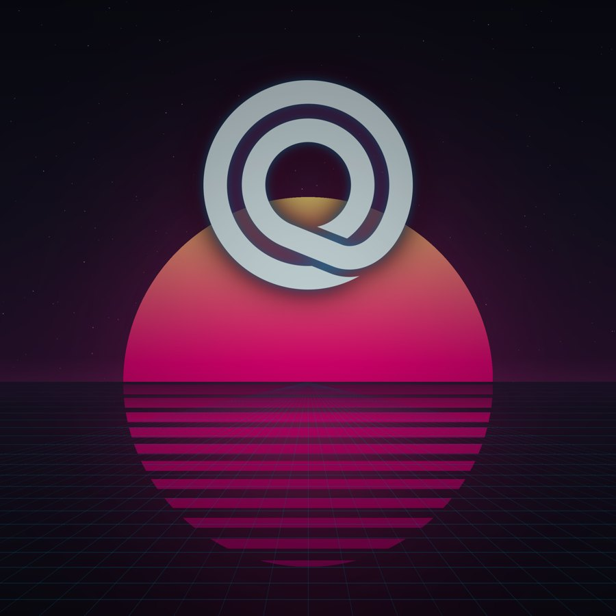
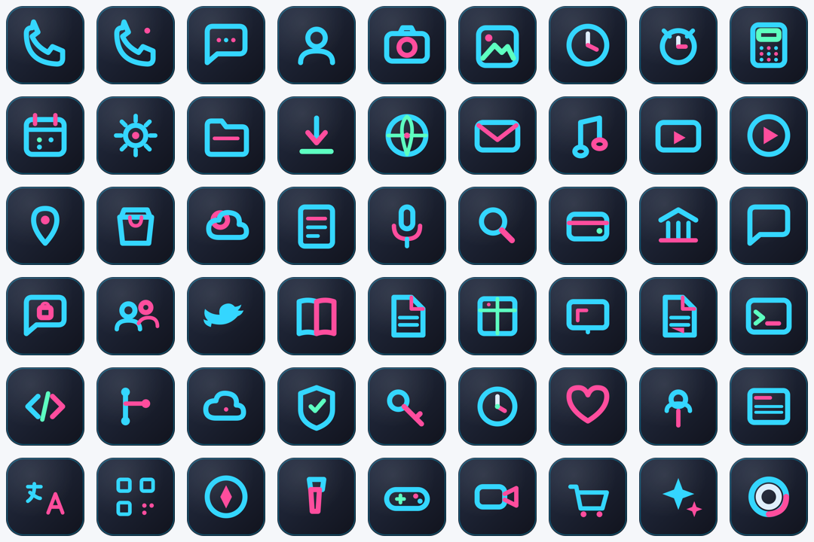
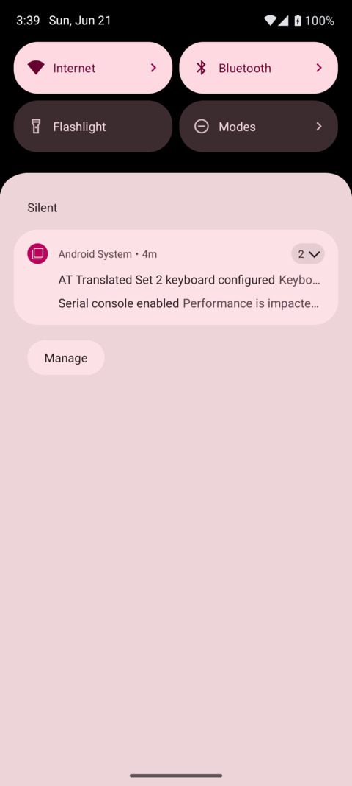
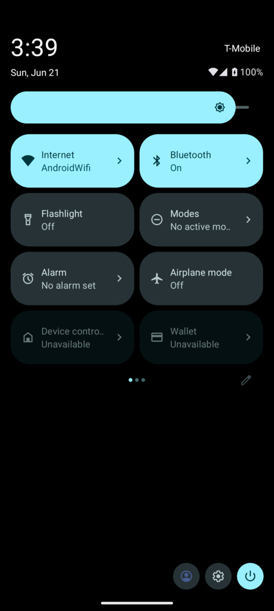

# OneQode — GrapheneOS / Android Theme Suite

The OneQode look for the **Google Pixel 10 Pro Fold** (codename *rango*) running
**GrapheneOS** — a companion to the [OneQode KDE theme suite](https://github.com/matt-shearing/oneqode-kde-themes).
Same design language, two variants:

- **OneQode Light Glass** — light, glassy, ice-cyan (`#00b4c8`) for daytime.
- **OneQode Night Ride** — dark synthwave, neon pink (`#ff0080`) + cyan (`#00c8ff`) for night.

[](https://github.com/matt-shearing/oneqode-graphene-theme/releases/latest)
[](https://apps.obtainium.imranr.dev/redirect.html?r=obtainium://app/%7B%22id%22%3A%20%22com.oneqode.theme%22%2C%20%22url%22%3A%20%22https%3A//github.com/matt-shearing/oneqode-graphene-theme%22%2C%20%22author%22%3A%20%22matt-shearing%22%2C%20%22name%22%3A%20%22OneQode%20Theme%22%2C%20%22additionalSettings%22%3A%20%22%7B%5C%22apkFilterRegEx%5C%22%3A%20%5C%22theme%5C%22%2C%20%5C%22invertAPKFilter%5C%22%3A%20false%7D%22%2C%20%22overrideSource%22%3A%20%22GitHub%22%7D)
[](https://github.com/matt-shearing/oneqode-graphene-theme/releases/latest/download/oneqode-theme-release.apk)

> **Install in one tap:** on the phone, tap **Install with Obtainium** above (needs the
> [Obtainium](https://obtainium.imranr.dev) app). Full steps in [Install](#install).

| Light Glass (inner) | Night Ride (inner) |
|---|---|
|  |  |



**Automatic day/night, verified live on Android 16** — the companion app flips the
accent + wallpaper on a schedule (Quick Settings shown below: pink at night, cyan
by day):

| Night (accent #ff0080) | Day (accent #00b4c8) |
|---|---|
|  |  |

## What's in the box

| Component | What it is | Auto day/night? |
|-----------|-----------|-----------------|
| **OneQode Theme app** (`dist/oneqode-theme-release.apk`) | Companion app that switches the **accent** (cyan ↔ pink) **and wallpaper** (Light Glass ↔ Night Ride) on a **solar/fixed schedule** — the KDE-switcher equivalent. Native, no launcher. | ✅ **Automatic** |
| **Wallpapers** | Light + dark, rendered for **both** foldable screens (near-square inner + 20:9 cover), crease- and hole-punch-aware | via the app |
| **Icon pack** (`dist/oneqode-iconpack-release.apk`) | *Optional.* ~125 apps mapped to cohesive OneQode line icons + monochrome themed icons. Only needed if you want the **custom colored** icons (requires Lawnchair). | Themed icons follow Material You |
| **ADB tools** (`tools/`) | One-shot accent/wallpaper helpers if you'd rather not install the app | — |

> **Tested on Android 16 (API 36):** the companion app's day/night switching is
> verified end-to-end on an emulator — accent live-retints the system UI
> (pink ↔ cyan), wallpaper swaps, and the solar/fixed schedule fires correctly.
> See `docs/` screenshots.

## Reality check: what's possible on GrapheneOS (read this first)

GrapheneOS is hardened AOSP with **no root**, and that sets a hard ceiling on
theming. This suite does everything that's possible *without* root and is honest
about the rest:

**✅ Done here (no root):**
- Wallpapers for both screens.
- A full icon pack with **themed/monochrome icons** — which is exactly where
  Android is heading: **Android 16 QPR2+ auto-themes every icon**, so our pack is
  forward-compatible into Android 17.
- Exact Material You accent via ADB (`settings put secure …` — no root needed).

**❌ Not possible without root (so not faked):**
- System **font** replacement, custom **boot animation**, system-wide overlays
  (Substratum/RRO), rich lock-screen clock faces. GrapheneOS doesn't support root
  and these need system-partition or root access. See `docs/grapheneos-notes.md`.

**Day/night:** Android can't schedule an accent change on its own, so the
**OneQode Theme app** does it (granted one permission via ADB; no root). Pair it
with GrapheneOS's built-in **Dark theme schedule** for a fully synced day/night.

## Install — the native path (recommended)

This is the clean, no-launcher path: install the app, grant it once, done. It
switches accent + wallpaper automatically on a solar schedule.

### 1 · Install the OneQode Theme app

[](https://apps.obtainium.imranr.dev/redirect.html?r=obtainium://app/%7B%22id%22%3A%20%22com.oneqode.theme%22%2C%20%22url%22%3A%20%22https%3A//github.com/matt-shearing/oneqode-graphene-theme%22%2C%20%22author%22%3A%20%22matt-shearing%22%2C%20%22name%22%3A%20%22OneQode%20Theme%22%2C%20%22additionalSettings%22%3A%20%22%7B%5C%22apkFilterRegEx%5C%22%3A%20%5C%22theme%5C%22%2C%20%5C%22invertAPKFilter%5C%22%3A%20false%7D%22%2C%20%22overrideSource%22%3A%20%22GitHub%22%7D)

- **Obtainium (auto-updates):** install [Obtainium](https://obtainium.imranr.dev),
  then tap the badge above — it pre-configures the app **and** sets the APK filter
  to `theme` so the right APK is picked.
  - Adding the repo URL by hand instead? This release contains two APKs (theme +
    icon pack), so set **Filter APKs by Regular Expression** to `theme` in the
    app's options, or Obtainium may grab the wrong one (see Troubleshooting).
- **Or direct:** [oneqode-theme-release.apk](https://github.com/matt-shearing/oneqode-graphene-theme/releases/latest/download/oneqode-theme-release.apk)
  · **or ADB:** `adb install dist/oneqode-theme-release.apk`

### 2 · Grant the accent permission (one time, no root)

From a computer with the phone connected (enable *Developer options →
Wireless/USB debugging* first):

```bash
adb shell pm grant com.oneqode.theme android.permission.WRITE_SECURE_SETTINGS
```

The app's home screen shows a green “✓ Accent control granted” banner once this is
done. (Wallpaper switching works even without it; only the accent needs it.)

### 3 · Configure & go

Open **OneQode Theme**:
- Pick **Solar** (enter your latitude/longitude) or **Fixed** (day/night times).
- Choose what to switch: **Accent**, **Wallpaper**, or both.
- Tap **Save & schedule**. Use **Apply Day/Night now** to preview, or the
  **Quick Settings tile** to flip manually.

### 4 · Sync the light/dark UI (optional but recommended)

An app can't flip global dark mode without a privileged permission, so let
GrapheneOS do it: **Settings → Display → Dark theme → Schedule → Sunset to
sunrise**. Now the whole UI, accent, and wallpaper all move together day↔night.

---

## Optional: custom colored icon pack (needs Lawnchair)

Everything above gives you the OneQode accent + wallpaper + (with themed icons on)
a monochrome system-tinted icon look on the **stock launcher** — no launcher swap.
Install the icon pack **only** if you specifically want the bespoke *colored*
OneQode glyph icons, which require a launcher that supports icon packs.

- Install: [**one-tap Obtainium link** (pre-sets filter to `iconpack`)](https://apps.obtainium.imranr.dev/redirect.html?r=obtainium://app/%7B%22id%22%3A%20%22com.oneqode.iconpack%22%2C%20%22url%22%3A%20%22https%3A//github.com/matt-shearing/oneqode-graphene-theme%22%2C%20%22author%22%3A%20%22matt-shearing%22%2C%20%22name%22%3A%20%22OneQode%20Icon%20Pack%22%2C%20%22additionalSettings%22%3A%20%22%7B%5C%22apkFilterRegEx%5C%22%3A%20%5C%22iconpack%5C%22%2C%20%5C%22invertAPKFilter%5C%22%3A%20false%7D%22%2C%20%22overrideSource%22%3A%20%22GitHub%22%7D),
  or [direct APK](https://github.com/matt-shearing/oneqode-graphene-theme/releases/latest/download/oneqode-iconpack-release.apk),
  or `adb install dist/oneqode-iconpack-release.apk`.

### Apply it in Lawnchair

The stock GrapheneOS launcher **cannot use icon packs**, so install **Lawnchair**
from **https://lawnchair.app** (not the Play/F-Droid “v2” — that one's abandoned).

1. Long-press the home screen → **Home settings**.
2. **General → Icon Pack → OneQode**.
3. Enable **Themed icons** (*General → Icon Style / Themed icons*).
   - On Android 16 QPR2+ this themes *every* app; OneQode ships hand-tuned
     monochrome icons for ~125 common apps so they look intentional, not auto-traced.
4. Themed icons follow Material You, so they re-tint automatically when you switch
   wallpaper/accent between Light Glass and Night Ride.

> Nova / Action / Apex instead? Settings → Look & feel → **Icon theme → OneQode**.
> More tuning tips in [`lawnchair/README.md`](lawnchair/README.md).

## Manual alternative (no app)

Prefer not to install the companion app? You can drive the same accent + wallpaper
one-shot over ADB (no automatic switching):

```bash
tools/oneqode-accent.sh night      # accent → #ff0080  (day | reset also work)
tools/apply-wallpapers.sh night    # push wallpapers, then pick in the picker
```

For the foldable, set each screen from the matching state: **unfold** → inner
(`*-inner.png`, mark above the fold crease), **fold** → cover (`*-cover.png`).

## Building from source

Prebuilt, signed APKs ship in `dist/`. To rebuild (no Android Studio required):

```bash
# one-time: fetch a minimal headless Android SDK into ~/.android-sdk-oneqode
tools/bootstrap-sdk.sh

# companion app (aapt2 + javac + d8 + apksigner)
companion/build-cli.sh                  # -> dist/oneqode-theme-release.apk

# icon pack: regenerate art + mappings, then build & sign
python3 iconpack/tools/forge.py         # forges icons + monochrome vectors
python3 iconpack/tools/appfilter.py     # generates appfilter / grayscale / drawable xml
iconpack/build-cli.sh                   # -> dist/oneqode-iconpack-release.apk
```

### Test it on an emulator (no phone needed)

```bash
tools/bootstrap-emulator.sh             # installs Android 16 image + creates AVD
$ANDROID_SDK_ROOT/emulator/emulator -avd oneqode -no-window -gpu swiftshader_indirect &
adb wait-for-device
adb install dist/oneqode-theme-release.apk
adb shell pm grant com.oneqode.theme android.permission.WRITE_SECURE_SETTINGS
# then drive it: am start .../MainActivity, or am broadcast .../AlarmReceiver
```

This is how the day/night switching was verified on Android 16 (see `docs/`).
Android Studio users can instead open `iconpack/` or `companion/` as Gradle
projects; CI builds via `.github/workflows/build.yml`.

> **Signing:** `build-cli.sh` auto-creates a dev keystore at
> `iconpack/keystore/oneqode-release.jks` (password `oneqode`). **Rotate this for
> any real distribution** — and note that updating an installed APK requires the
> *same* signing key. For Accrescent distribution you sign with your own key and
> ship split APKs.

## Regenerating / extending

| To change… | Edit… | Then run |
|------------|-------|----------|
| Wallpaper art | `wallpapers/src/generate_wallpapers.py` | `python3 wallpapers/src/generate_wallpapers.py` |
| Icon glyphs / colours | `iconpack/tools/forge.py` | `forge.py` → `appfilter.py` → `build-cli.sh` |
| App → icon mappings | `iconpack/tools/appfilter.py` | `appfilter.py` → `build-cli.sh` |
| Add an app it misses | `tools/dump-components.sh <kw>` to find the component, add to `appfilter.py` | rebuild |

## Repository layout

```
oneqode-graphene-theme/
├── brand/                  OneQode logo SVGs + palette.md (single source of truth)
├── wallpapers/
│   ├── src/                generator
│   ├── light-glass/        inner.png + cover.png
│   └── night-ride/         inner.png + cover.png
├── iconpack/
│   ├── app/src/main/       AndroidManifest, res/ (icons, appfilter, grayscale map), MainActivity
│   ├── tools/              forge.py (icons), appfilter.py (mappings)
│   ├── build-cli.sh        no-Gradle build (aapt2/javac/d8/apksigner)
│   └── build.gradle …      Android Studio / Gradle path
├── tools/
│   ├── bootstrap-sdk.sh    fetch headless Android SDK
│   ├── oneqode-accent.sh   pin Monet accent over ADB
│   ├── apply-wallpapers.sh push wallpapers over ADB
│   └── dump-components.sh  list device components for extending the pack
├── lawnchair/README.md     launcher setup + recommended settings
├── docs/                   previews + grapheneos-notes.md
└── dist/                   built, signed APK
```

## Troubleshooting

**Obtainium: "Downloaded package ID does not match existing app ID –
com.oneqode.theme".** This release ships two APKs with different package IDs
(`com.oneqode.theme` + `com.oneqode.iconpack`), and Obtainium tracks one package
per app, so it can grab the wrong APK. Fix: open the app in Obtainium → set
**Filter APKs by Regular Expression** to `theme` (or `iconpack` for the other) →
save. The one-tap badge links above already set this; use them, or re-add via the
badge. Quickest unblock: install the
[direct APK](https://github.com/matt-shearing/oneqode-graphene-theme/releases/latest/download/oneqode-theme-release.apk).

## Design reference

See `brand/palette.md` for the full colour system, the foldable canvas sizes, and
safe-zone rules — kept in lockstep with the OneQode KDE suite.

## License

MIT — see `LICENSE`. OneQode brand mark © OneQode. Icon glyphs are original
geometric category marks; no third-party brand logos are reproduced.
